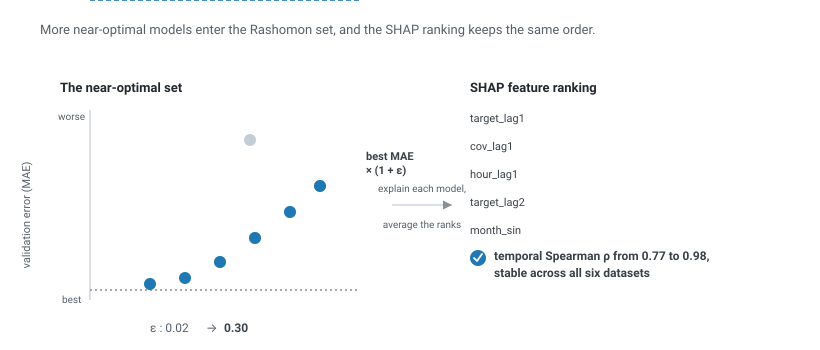
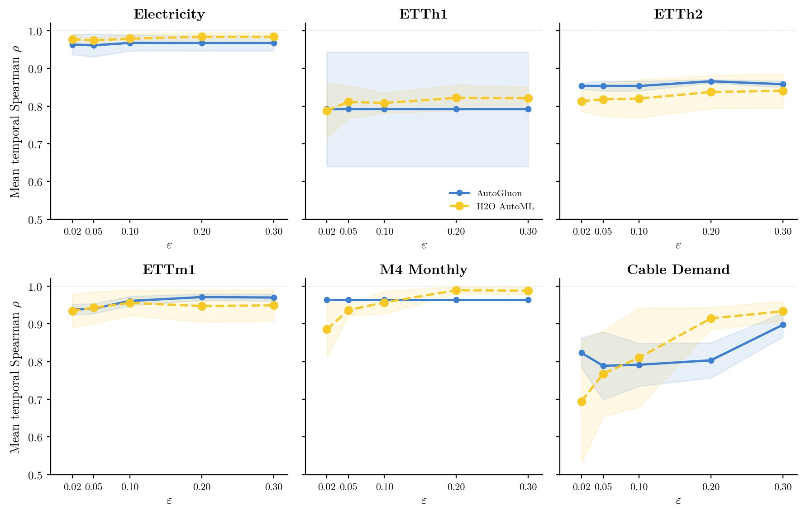
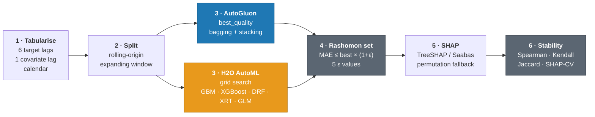

<div align="center">

# Rashomon &times; SHAP

**Feature importance stability across near-optimal AutoML models for time series forecasting**

Master's thesis &middot; Devika Rajasekar &middot; Leiden University &middot; 2026


</div>

---

An AutoML search returns many models with near-identical predictive accuracy. Explaining any one of them with SHAP produces a single feature-importance ranking. Whether a different, equally accurate model would produce the same ranking is examined here.

This thesis measures that across six datasets and two AutoML frameworks. In short, **SHAP-based feature importance rankings stay stable across the near-optimal (Rashomon) set under both frameworks**, with mean temporal Spearman ρ from 0.77 (Cable Demand) to 0.98 (Electricity) at a 5% error tolerance. Framework choice changes how large the set is and which model families it contains. Neither of those affects stability.

<div align="center">

</div>

> If you are new to any of these terms, I have written a [glossary](GLOSSARY.md) that defines AutoML, SHAP, the Rashomon set, the model families, and the table columns.

## Question

A *Rashomon set* is every model whose validation error falls within a tolerance ε of the best:

$$R(\varepsilon) = \{\, m : \mathrm{MAE}_{\mathrm{val}}(m) \le \mathrm{MAE}_{\mathrm{val}}(m^{*}) \times (1 + \varepsilon) \,\}$$

Here MAE is measured on the validation split, m\* is the best model (the one with the lowest validation MAE), and a model enters R(ε) when its own validation MAE is at most (1 + ε) times that of m\*. At ε = 0.05, that admits every model within 5% of the best. Widening ε only ever adds models, so the set grows outward from the best model.

If the models inside disagree on feature ranking, the explanation reported depends on which model happened to rank first rather than on the data (Fisher et al., 2019).

**Primary question.** Do SHAP-based feature importance explanations stay stable across the empirical Rashomon set in AutoML time series forecasting?

**RQ1.** Do data characteristics predict *where* attribution variability concentrates across near-optimal models?
**RQ2.** Does framework choice shape the composition of the set, and does that composition determine how stable the explanations are?

## Answer

Mean temporal Spearman ρ at ε = 0.05, aggregated on per-model ranks across seeds and rolling-origin splits. AutoGluon rankings exclude the `item_id` series identifier. Set size is the range of qualifying models over seed and split.

| Dataset | AutoGluon ρ | AG set size | H2O AutoML ρ | H2O set size |
|---|---|---|---|---|
| Electricity | 0.961 | 4-5 | 0.975 | 11-15 |
| ETTh1 | 0.792 | 1 | 0.811 | 2-11 |
| ETTh2 | 0.853 | 1-3 | 0.818 | 1-7 |
| ETTm1 | 0.941 | 1-2 | 0.943 | 4-13 |
| M4 Monthly | 0.964 | 1 | 0.937 | 1-7 |
| Cable Demand | 0.789 | 1-2 | 0.768 | 1-8 |

H2O sets reach 15 models and span five model families, where AutoGluon's top out at 5 and stay within one. Both ρ columns still agree within 0.04 on every dataset. The frameworks differ in composition and match in stability.

Rankings are aggregated on per-model ranks (rank-then-mean), which is scale-invariant. Raw SHAP magnitudes are not comparable across H2O's explainer families (exact TreeSHAP for GBM and XGBoost, Saabas for DRF and XRT, permutation for GLM), so a magnitude average would be governed by whichever family produces the largest raw values.

<div align="center">

<br/><sub>Mean ρ against ε. Profiles are flat or gently rising under both frameworks, with no collapse at any ε.</sub>
</div>

AutoGluon's `best_quality` preset bags and stacks. In practice one bagged learner, a LightGBM variant on most datasets, is far enough ahead that the qualifying models stay within one family across all five ε thresholds and the sets stay small, down to a single model on ETTh1 and M4 Monthly. H2O AutoML runs a random grid search across GBM, XGBoost, DRF, XRT and GLM, so its sets are larger and mix families. Stability persists in both regimes.

<div align="center">

</div>

Under RQ1, data characteristics predict which feature group carries what little disagreement there is, without predicting whether disagreement happens. Features fall into three groups: autoregressive target lags, covariate lags, and calendar features. Under H2O, target lags are the most variable group on Electricity, ETTm1 and ETTh1, and a covariate or calendar group elsewhere. A dual-explainer control, which re-explains the identical models with a single explainer, shows the grouping is set by the SHAP explainer on two of those three datasets and by the models or data on the third (ETTh1).

## How the pipeline works

Both frameworks run the same six stages. 



## Datasets

Six datasets, three domains, two resolutions. All are converted to supervised feature matrices via lag extraction, with temporal integrity preserved by rolling-origin expanding-window splits.

| Dataset | Frequency | Series | Splits | Notes |
|---|---|---|---|---|
| Electricity | 15-min | 20 | 3 | UCI LD2011-2014, 20-series subset |
| ETTh1 | Hourly | 1 | 3 | Electricity Transformer Temperature |
| ETTh2 | Hourly | 1 | 3 | Electricity Transformer Temperature |
| ETTm1 | 15-min | 1 | 3 | Electricity Transformer Temperature |
| M4 Monthly | Monthly | 50 | 2 | M4 Competition subset |
| Cable Demand | Monthly | 10 | 4 | Proprietary, data not included in this repository |

## Reproduce

Requires Python 3.9+ and **Java 8+ on PATH** for H2O (installed separately, outside pip).

```bash
python -m venv .venv && source .venv/bin/activate   # Windows: .venv\Scripts\activate
pip install -r requirements.txt
java -version                                        # verify before any H2O run
```

```bash
# Train one dataset
python src/autogluon_pipeline.py --config configs/ag/bq/electricity.yaml
python src/h2o_pipeline.py       --config configs/h2o/h2o_electricity.yaml

# Preprocess Cable Demand once, before its first run
python scripts/preprocess_cable_demand.py

# Figures: robustness CSVs first, then the thesis figures
python analysis/robustness_shap_method_check.py
python analysis/make_figures.py
```

Shared settings across all configs: **1800 s** per split and seed, **seeds [0, 1, 2]**, ε &isin; {0.02, 0.05, 0.10, 0.20, 0.30}, at most 20 models per set.

Five of the six datasets reproduce end to end from a clean clone, because the public benchmarks download and cache on first use. Cable Demand will not, because its panel is proprietary and cannot be redistributed. Its preprocessing script and configs are included so the method stays auditable. To run them on another panel, supply a table with `item_id`, `timestamp`, `target` and any covariates, then point `data.real.panel_path` at it.

`results/` is not committed. Running the pipeline regenerates it, and the figure scripts read from it. `figures/fig_robustness_bars.png` rebuilds from the committed robustness CSVs alone.

<details>
<summary><b>Full module map</b> (every file, formula, and source)</summary>

<br/>

### `src/`

| File | What it does | Formula | Source |
|---|---|---|---|
| `autogluon_pipeline.py` | AutoGluon orchestrator: load, split, train, build sets, SHAP, stability | orchestration | Erickson et al. (2020) |
| `h2o_pipeline.py` | H2O orchestrator, mirroring the AutoGluon stages. Needs Java 8+ | orchestration | LeDell & Poirier (2020) |
| `pipeline_stage_runner.py` | Shared stages: data loading, output layout, final reports |  | |
| `pipeline_utils.py` | Config loading, seeding, hardware detection, IO helpers |  | |
| `timeseries_to_tabular.py` | Panel to supervised matrix: 6 target lags, 1 covariate lag, calendar. Rows indexed by `label_timestamp` to prevent horizon leakage | lag embedding | |
| `temporal_cross_validation.py` | Rolling-origin expanding-window splits | eq:train_set / eq:val_set / eq:test_set | thesis ch. 3.4 |
| `autogluon_trainer.py` | AutoGluon best_quality wrapper (bagging + stacking), per-model validation MAE | MAE | Erickson et al. (2020) |
| `h2o_trainer.py` | H2O AutoML wrapper and JVM lifecycle. Drops `item_id` before training | MAE | LeDell & Poirier (2020) |
| `rashomon_set_builder.py` | Filters the leaderboard to the empirical Rashomon set at each ε | eq:rashomon | Fisher et al. (2019), Marx et al. (2020) |
| `shap_autogluon.py` | TreeExplainer where supported, chunked permutation explainer otherwise | eq:global_importance | Lundberg & Lee (2017) |
| `shap_h2o.py` | `predict_contributions()`: exact TreeSHAP for GBM and XGBoost, Saabas for DRF and XRT, permutation for GLM and ensembles | eq:global_importance | Lundberg et al. (2020) |
| `stability_metrics.py` | Spearman ρ, Kendall τ<sub>b</sub>, top-k Jaccard with k = round(0.30 &times; p), bootstrap CIs, ε sensitivity | ch. 3.8 | Kendall (1945); Nogueira et al. (2018) |
| `importance_aggregation.py` | Mean, quantiles, SHAP-CV, per-model ranks, rank-then-mean aggregation. Defines `NON_FEATURE_COLUMNS` | eq:shap_cv / eq:shap_range | Fisher et al. (2019) |
| `results_visualizer.py` | Per-run plots: bands, violins, rank heatmaps, agreement matrices |  | |
| `benchmark_datasets.py` | Loaders for M4, Electricity (UCI), ETT. They download and cache on first use |  | Makridakis et al. (2020), Trindade (2015), Zhou et al. (2021) |

### `analysis/`

| File | What it does |
|---|---|
| `make_figures.py` | Single entry point, builds the six thesis figures |
| `figlib/style.py` | Palette, matplotlib presets, `save_fig` (PDF + PNG), and the empty-figure guard |
| `figlib/datasets.py` | Canonical dataset registry (names, run directories, ε grid) |
| `figlib/data.py` | Result-CSV loaders, feature-group classification, group-level SHAP-CV |
| `figures/rashomon_size.py` | Rashomon set size against ε |
| `figures/epsilon_sensitivity.py` | Mean ρ against ε per dataset |
| `figures/stability_heatmap.py` | ρ heatmap at ε = 0.05 |
| `figures/stability_vs_size.py` | ρ against Rashomon set size |
| `figures/shap_cv_groups.py` | SHAP-CV by feature group, H2O restricted to exact-TreeSHAP families |
| `figures/robustness_bars.py` | H2O ρ under three model subsets, reads the robustness CSVs |
| `robustness_shap_method_check.py` | Recomputes ρ for nested family subsets (full set, GLM removed, tree-exact) |

### `scripts/`

| File | What it does |
|---|---|
| `preprocess_cable_demand.py` | Raw CSV export to clean panel parquet. Run once before the first Cable Demand run |
| `run_h2o_all.sh` | Runs the H2O pipeline across all six datasets with per-dataset logs |
| `run_benchmark_validation.py` | Structure and consistency checks on the benchmark loaders |

**Note on `item_id`.** The series identifier is excluded from every feature ranking via `NON_FEATURE_COLUMNS` in `src/importance_aggregation.py`. AutoGluon receives the column as a model input, so SHAP attributes importance to it. Leaving it in would inflate the top-k threshold k = round(0.30 &times; p) and let an identifier compete for top-k slots. H2O never sees it, because its trainer drops the column before training.

</details>

<details>
<summary><b>Metrics</b></summary>

<br/>

| Metric | Description |
|---|---|
| Spearman ρ | Rank correlation of importance vectors across splits (ch. 3.8) |
| Kendall τ<sub>b</sub> | Tie-corrected pairwise concordance (ch. 3.8) |
| Jaccard | Top-k overlap, $k=\mathrm{round}(0.30\times p)$ (ch. 3.8) |
| SHAP-CV | Coefficient of variation of mean absolute SHAP across the set (eq:shap_cv) |
| SHAP-range | Absolute spread of mean absolute SHAP across the set (eq:shap_range) |

</details>

## Citation

```bibtex
@mastersthesis{rajasekar2026rashomon,
  title   = {Feature Importance Stability Across Near-Optimal AutoML Models
             for Time Series Forecasting},
  author  = {Rajasekar, Devika},
  year    = {2026},
  school  = {Leiden University}
}
```

<details>
<summary><b>References</b></summary>

<br/>

- Erickson, N., Mueller, J., Shirkov, A., Zhang, H., Larroy, P., Li, M., & Smola, A. (2020). AutoGluon-Tabular: Robust and Accurate AutoML for Structured Data. *arXiv:2003.06505*.
- Fisher, A., Rudin, C., & Dominici, F. (2019). All Models are Wrong, but Many are Useful. *Journal of Machine Learning Research*, 20(177).
- Kendall, M. G. (1945). The Treatment of Ties in Ranking Problems. *Biometrika*, 33(3).
- LeDell, E., & Poirier, S. (2020). H2O AutoML: Scalable Automatic Machine Learning. *AutoML Workshop at ICML*.
- Lundberg, S. M., & Lee, S.-I. (2017). A Unified Approach to Interpreting Model Predictions. *NeurIPS 30*.
- Lundberg, S. M., Erion, G., Chen, H., DeGrave, A., Prutkin, J. M., Nair, B., Katz, R., Himmelfarb, J., Bansal, N., & Lee, S.-I. (2020). From Local Explanations to Global Understanding with Explainable AI for Trees. *Nature Machine Intelligence*, 2(1), 56-67.
- Makridakis, S., Spiliotis, E., & Assimakopoulos, V. (2020). The M4 Competition: 100,000 Time Series and 61 Forecasting Methods. *International Journal of Forecasting*, 36(1).
- Marx, C., Calmon, F., & Ustun, B. (2020). Predictive Multiplicity in Classification. *ICML*.
- Nogueira, S., Sechidis, K., & Brown, G. (2018). On the Stability of Feature Selection Algorithms. *Journal of Machine Learning Research*, 18(174).
- Trindade, A. (2015). ElectricityLoadDiagrams20112014. *UCI Machine Learning Repository*.
- Zhou, H., Zhang, S., Peng, J., Zhang, S., Li, J., Xiong, H., & Zhang, W. (2021). Informer: Beyond Efficient Transformer for Long Sequence Time-Series Forecasting. *AAAI*.

</details>
